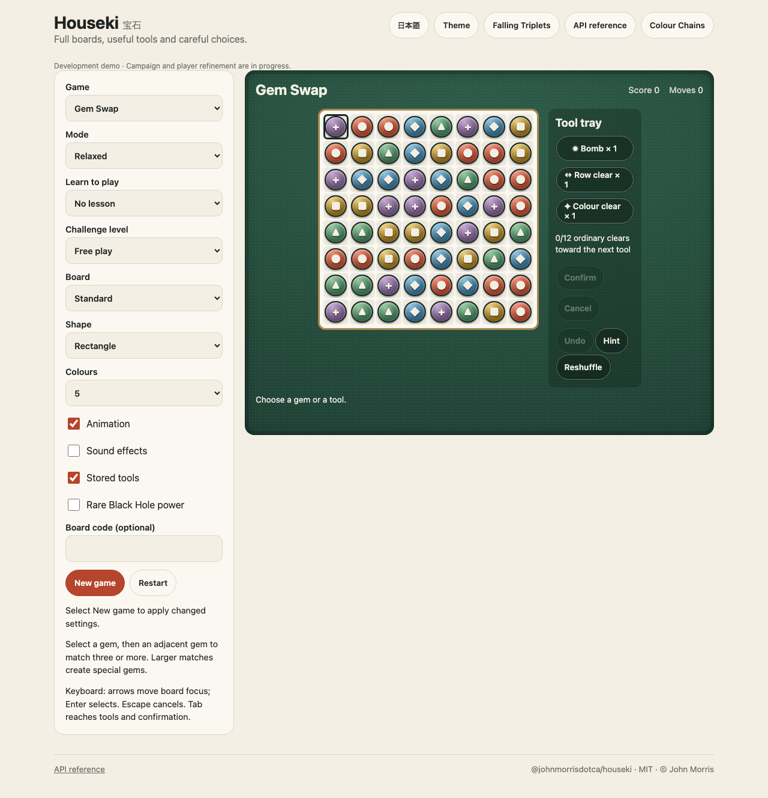
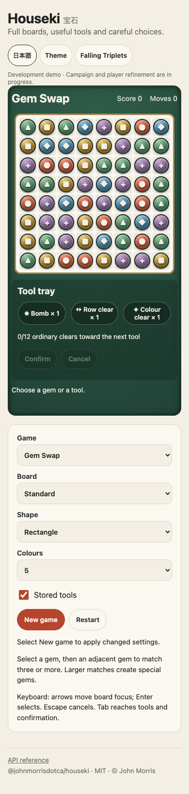
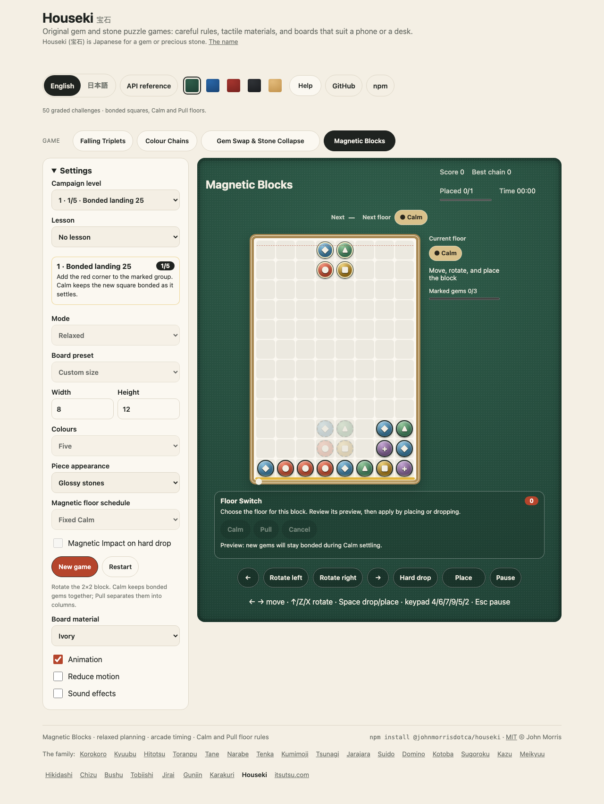

<h1 align="center">Houseki <sub>宝石</sub></h1>

<p align="center"><strong>Five original gem and stone puzzle games for JavaScript and TypeScript.</strong><br>
Falling Triplets, Colour Chains, Stone Collapse and Gem Swap: each an immutable, seeded rules engine that runs anywhere, with graded challenges and lessons, saves that replay to the same board, and a keyboard, keypad and touch player in the demo. Magnetic Blocks adds bonded squares, a magnetic floor and its own campaign. Shizen and Arashi each add a separate Colour Chains campaign. In English and Japanese. No dependencies.</p>

<p align="center">
  <a href="https://github.com/johnmorrisdotca/houseki/actions/workflows/ci.yml"></a>
  <a href="https://www.npmjs.com/package/@johnmorrisdotca/houseki"></a>
  <a href="./LICENSE"></a>
  
  
</p>

<p align="center"><a href="https://johnmorrisdotca.github.io/houseki/"><strong>Play a game →</strong></a> · <a href="https://johnmorrisdotca.github.io/houseki/api.html">API reference</a></p>

<p align="center">
  
  
</p>

Houseki is a set of match-style puzzle games made to be dropped into a page or a server. Every game is a set of plain functions on plain data: a state in, a new state out, nothing read from the page, the clock or the network. The demo's players draw those states, and a person can play them with the keyboard, a keypad or a finger.

## In 30 seconds

```sh
npm install @johnmorrisdotca/houseki
```

```ts
import { createGame, applyAction, advanceTicks } from "@johnmorrisdotca/houseki/falling-triplets";

let game = createGame({ mode: "relaxed", seed: "first-game" });
game = applyAction(game, { kind: "cycle-forward" }).state;
game = applyAction(game, { kind: "place" }).state;
game = advanceTicks(game, 22).state;
```

Every engine is a path of its own, and the main entry groups them by game:

```ts
import { colourChains } from "@johnmorrisdotca/houseki";

const firstChallenge = colourChains.createLevel(1);
const goal = firstChallenge.settings.goal;
```

Or straight from a page, with nothing to build:

```html
<script type="module">
  import { createGame } from "https://cdn.jsdelivr.net/npm/@johnmorrisdotca/houseki@0/dist/gem-swap.js";
  const game = createGame({ seed: "hello" });
</script>
```

## Who it is for

- **Game and puzzle sites** that want match games with the rules already right: challenges everybody plays alike, a win that is witnessed, and saves that cannot drift.
- **Anyone who needs the rules without a screen**: a server that checks a finished game, a test that plays a campaign, a bot, a solver. Every engine is deterministic from its seed.
- **Teachers and parents**: nothing is timed against you in Relaxed play, every colour has its own permanent symbol, and every word is plain.

## Features

- **Five games**, each its own engine and its own entry point: [Falling Triplets](docs/design/01-FALLING-TRIPLETS.md), [Stone Collapse](docs/design/02-STONE-COLLAPSE.md), [Colour Chains](docs/design/03-COLOUR-CHAINS.md) [Gem Swap](docs/design/04-GEM-SWAP.md) and [Magnetic Blocks](docs/design/CAMPAIGN-EXTENSIONS.md).
- **Graded campaigns and lessons**: 100 Falling Triplets, 50 Colour Chains, 100 Stone Collapse, 50 Gem Swap, 50 Magnetic Blocks, 50 Shizen and 50 Arashi challenges (450 total), ordered by measured difficulty, each with a recorded winning play that the tests replay, and three guided lessons for each game. The boards are original, regenerated from a script, and a challenge keeps its identity if the order changes.
- **Three modes**: Relaxed (no clock, plan each move), Arcade (a timer drops the pieces) and Daily (the same board for everyone on a date).
- **Seeded and replayable**: a state is made from a seed and a list of actions, so a save is that list, and it decodes to exactly the board it came from.
- **Configurable boards**: presets from compact to extra wide and deep, custom sizes within stated limits, up to six colours, and shaped boards (heart, star, hexagon) for the full-board games.
- **Stored tools** for Gem Swap (Bomb, Row clear, Colour clear) and Stone Collapse (Bomb, Pick): select a tool and a stone, look at the highlighted effect, then confirm or cancel. A run that uses a tool is marked assisted. An optional earned Black Hole shrinks as it consumes nearby gems.
- **Nature, optional**: Shizen magnetic stones with one bounded rebound, and Arashi weather, a rare or frequent earthquake that jumbles stones and lightning that removes exposed ones, on a seeded schedule.
- **Magnetic Blocks**: bonded 2×2 squares, a floor that turns magnetic on a schedule, a one-use Floor Switch and impact drops. Its fifty challenges introduce Calm/Pull choices, planned floor schedules, the Floor Switch and impact drops.
- **Accessible**: permanent colour symbols, keyboard and keypad control, an Animation setting that is on by default and a reduced-motion choice that is respected.
- **Light and dark** that follow the device, in the demo's family look.
- **English and Japanese** words for every lesson, challenge, button and line of the demo.
- **Zero dependencies**, for the package and for the demo.

### The games

| Game | Entry | You | A match is | Challenges |
| --- | --- | --- | --- | --- |
| Falling Triplets | `falling-triplets` | cycle a falling vertical triplet and place it | a line of three, across, down or diagonal | 100 |
| Stone Collapse | `stone-collapse` | select a connected group and confirm | two or more touching stones of one colour | 100 |
| Colour Chains | `colour-chains` | rotate a falling pair | a group of four or more | 50 |
| Gem Swap | `gem-swap` | swap two neighbours | a run of three or more, which can make special gems | 50 |
| Magnetic Blocks | `magnetic-blocks` | rotate a falling 2×2 block | four connected gems, with Calm/Pull settling | 50 |
| Shizen | `colour-chains` | anticipate marked stones and rebound | four connected gems after attraction | 50 |
| Arashi | `colour-chains` | plan around earthquakes and lightning | four connected gems after weather | 50 |

## Use it in your project

Import a game directly from `@johnmorrisdotca/houseki/falling-triplets`, `@johnmorrisdotca/houseki/stone-collapse`, `@johnmorrisdotca/houseki/colour-chains`, `@johnmorrisdotca/houseki/gem-swap` or `@johnmorrisdotca/houseki/magnetic-blocks`, and the deterministic attraction, rebound and environment utilities from `@johnmorrisdotca/houseki/nature`. The main entry, `@johnmorrisdotca/houseki`, groups the same names as the namespaces `fallingTriplets`, `stoneCollapse`, `colourChains`, `gemSwap`, `nature` and `magneticBlocks`. The engines do not touch the DOM, storage or the network.

Every engine works the same way:

```ts
import { createGame, createLevel, applyAction, advanceTicks, legalActions, encodeGame, decodeGame } from "@johnmorrisdotca/houseki/colour-chains";

const level = createLevel(1);                       // a graded challenge; createGame({ seed }) is a free game
const move = applyAction(level, { kind: "rotate-clockwise" });
move.accepted;                                      // false when the action is not allowed
move.events;                                        // what happened, in order, for a screen to animate
const later = advanceTicks(move.state, 30).state;   // time is a count of ticks, never the clock
const saved = encodeGame(later);                    // a string; decodeGame(saved) is the same game again
```

Every function returns a new state and leaves the one it was given untouched. `legalActions(state)` lists what may be done now, so a bot or a test needs no knowledge of the rules. The two full-board games, Gem Swap and Stone Collapse, also have an undo and a hint (`undoGame` and `hintGame` in Gem Swap, `undo` and `requestHint` in Stone Collapse) and a restart; their stored tools are actions of their own.

To run the whole demo, `pnpm install && pnpm site`, then serve `site/` with any static server. A page of the demo takes `?seed=anything` in its address to start the same board again, and `?lang=ja` for Japanese.

### Additional campaigns



```ts
import { createShizenLevel, createArashiLevel } from "@johnmorrisdotca/houseki/colour-chains";
import { createLevel } from "@johnmorrisdotca/houseki/magnetic-blocks";

const magneticStones = createShizenLevel(1);
const weather = createArashiLevel(1);
const bondedSquares = createLevel(1);
```

Each campaign has fifty fixed puzzles ordered from easy to hard. Use its manifest for stable IDs, bilingual titles, objectives, difficulty marks and verified winning plans. Select Shizen or Arashi in the Colour Chains demo, or a challenge in Magnetic Blocks. A campaign uses a finite queue with no falling clock; the goal and progress appear beside the board. Fixed rules stay visible, and the result offers replay or the next challenge. See the [campaign contract](docs/design/CAMPAIGN-EXTENSIONS.md).

## API

Every export of every entry point is in the [API reference](https://johnmorrisdotca.github.io/houseki/api.html), made from the source when the demo is built, with each signature and doc comment. A test fails when a public export has no doc comment.

## Theming

The engines draw nothing. The demo's players take their colours from the family's stylesheet, `demo/family.css`: custom properties for the page, ink, accent and the felt the board sits on, which follow `prefers-color-scheme`, and five table cloths (green, blue, red, black and wood) chosen in the header. The boards add their own `--board`, `--frame` and `--gem-edge` in `demo/houseki.css`, and a Board material choice (ivory, slate or wood). Gems are told apart by their symbol as well as their colour, so no choice of cloth hides a colour.

## Limits

| What | Limit |
| --- | --- |
| Colours | 4 to 6 |
| Colour Chains | 5 to 16 columns and 12 to 32 visible rows |
| Magnetic Blocks | 4 to 16 columns and 4 to 32 rows; at most 200 pieces in the demo |
| Stone Collapse | presets from 6×8 to 16×10 and 8×32 deep; shaped boards by mask |
| Daily mode | the standard board and colour count only, from a date |
| Saves | a replay of the actions taken, checked when it is decoded; a save that does not match its own record is refused |
| Tools | capped inventory, earned by ordinary clears, and not offered in Daily or in authored challenges |

## Browser support

The engines run wherever JavaScript does: Node 22 or later, and current Chrome, Edge, Firefox and Safari. The demo's tests run in Chromium and WebKit, at a phone's width and a desk's.

## Languages

The demo is in English and Japanese: every lesson and challenge title, button, status line and the family's header and footer. The Japanese has not yet been read by a native reader: corrections are welcome as a *Fix a translation* issue.

## Roadmap

Physical-device feel testing, a fluent Japanese review and human difficulty review of the campaigns are next, and new techniques for later campaigns. [docs/COVERAGE.md](docs/COVERAGE.md) says what is verified by tests and what is not. Nothing here is promised for a date.

## Architecture

```text
src/
├── colour-chains/
│   ├── challenge.ts
│   ├── content-data.ts
│   ├── content-types.ts
│   ├── content.ts
│   ├── engine.ts
│   ├── input.ts
│   ├── match.ts
│   ├── persistence.ts
│   ├── random.ts
│   ├── types.ts
│   └── validation.ts
├── colour-chains.ts
├── falling-triplets/
│   ├── content-data.ts
│   ├── content-types.ts
│   ├── content.ts
│   ├── engine.ts
│   ├── input.ts
│   ├── match.ts
│   ├── random.ts
│   └── types.ts
├── falling-triplets.ts
├── gem-swap/
│   ├── black-hole.ts
│   ├── board.ts
│   ├── content.ts
│   ├── engine.ts
│   ├── persistence.ts
│   ├── practice.ts
│   ├── random.ts
│   ├── specials.ts
│   ├── tools.ts
│   └── types.ts
├── gem-swap.ts
├── index.ts
├── magnetic-blocks/
│   ├── content-data.ts
│   ├── content-types.ts
│   ├── content.ts
│   ├── engine.ts
│   ├── persistence.ts
│   ├── physics.ts
│   ├── random.ts
│   ├── types.ts
│   └── validation.ts
├── magnetic-blocks.ts
├── nature/
│   ├── attraction.ts
│   ├── environment.ts
│   ├── marking.ts
│   ├── random.ts
│   ├── rebound.ts
│   ├── state.ts
│   ├── types.ts
│   └── validation.ts
├── nature.ts
├── stone-collapse/
│   ├── content-data.ts
│   ├── content-types.ts
│   ├── content.ts
│   ├── engine.ts
│   ├── persistence.ts
│   ├── types.ts
│   └── validation.ts
└── stone-collapse.ts
```

The [design pack](docs/design/README.md) specifies the rules, controls, materials, accessibility, level generation, grading, persistence and acceptance checks of every game; [level generation](docs/design/LEVEL-GENERATION.md) follows a deliberate complete count: generate and prove original boards, remove duplicates, grade the decisions a player faces, then sort and number from easy to hard.

## The name

Houseki (宝石) is Japanese for a gem or precious stone: the pieces of these games are cut and polished, and the games are small.

## Where it comes from

Match games are an old family and their rules are common property. These five are original: the rules are written out in the design pack in our own words, every board is generated and checked by the repository's own scripts, and the pictures are drawn in code. No art, sound or level comes from another game.

### The family

<!-- family:start (made by scripts/family-readme.mjs from scripts/family-template.mjs; change those, not this) -->
Houseki is one of twenty-four packages, each made for the same site, each at
[github.com/johnmorrisdotca](https://github.com/johnmorrisdotca). The code of every one is MIT.

- [Korokoro](https://github.com/johnmorrisdotca/korokoro) (コロコロ): dice, with notation, exact odds, real sounds and the dice of many games. [Demo](https://johnmorrisdotca.github.io/korokoro/).
- [Kyuubu](https://github.com/johnmorrisdotca/kyuubu) (キューブ): a turning cube for the browser, 2×2 to 7×7, with record solves to replay. [Demo](https://johnmorrisdotca.github.io/kyuubu/).
- [Hitotsu](https://github.com/johnmorrisdotca/hitotsu) (一つ): a colour-card shedding game for two to eight, with the house rules people play. [Demo](https://johnmorrisdotca.github.io/hitotsu/).
- [Toranpu](https://github.com/johnmorrisdotca/toranpu) (トランプ): a deck of playing cards, card games with computer players, and solitaires. [Demo](https://johnmorrisdotca.github.io/toranpu/).
- [Tane](https://github.com/johnmorrisdotca/tane) (種): seeded random numbers and daily seeds, the same in every browser and on every server. [Demo](https://johnmorrisdotca.github.io/tane/).
- [Narabe](https://github.com/johnmorrisdotca/narabe) (並べ): one rules engine for abstract board games, from gomoku and Reversi to Go and checkers. [Demo](https://johnmorrisdotca.github.io/narabe/).
- [Tenka](https://github.com/johnmorrisdotca/tenka) (天下): world conquest for two to six, on a map of the real world. [Demo](https://johnmorrisdotca.github.io/tenka/).
- [Kumimoji](https://github.com/johnmorrisdotca/kumimoji) (組み文字): a crossword tile race, in English and Japanese kana. [Demo](https://johnmorrisdotca.github.io/kumimoji/).
- [Tsunagi](https://github.com/johnmorrisdotca/tsunagi) (繋ぎ): a line-joining logic puzzle whose every level has exactly one answer. [Demo](https://johnmorrisdotca.github.io/tsunagi/).
- [Jarajara](https://github.com/johnmorrisdotca/jarajara) (ジャラジャラ): mahjong tiles drawn as SVG, stacked layouts, and the matching solitaire Awase. [Demo](https://johnmorrisdotca.github.io/jarajara/).
- [Suido](https://github.com/johnmorrisdotca/suido) (水道): a pipe puzzle: turn the pieces until the water reaches every drain. [Demo](https://johnmorrisdotca.github.io/suido/).
- [Domino](https://github.com/johnmorrisdotca/domino) (ドミノ): dominoes and Mexican Train. [Demo](https://johnmorrisdotca.github.io/domino/).
- [Kotoba](https://github.com/johnmorrisdotca/kotoba) (言葉): word lists and word-game rules in English, French, German and Japanese. [Demo](https://johnmorrisdotca.github.io/kotoba/).
- [Sugoroku](https://github.com/johnmorrisdotca/sugoroku) (双六): backgammon and its variants, with the doubling cube and match play. [Demo](https://johnmorrisdotca.github.io/sugoroku/).
- [Kazu](https://github.com/johnmorrisdotca/kazu) (数): grid number puzzles: Sudoku and its variants, Futoshiki and Skyscrapers. [Demo](https://johnmorrisdotca.github.io/kazu/).
- [Meikyuu](https://github.com/johnmorrisdotca/meikyuu) (迷宮): mazes on squares, hexagons, triangles and circles, made from a seed and drawn through with a finger or the mouse. [Demo](https://johnmorrisdotca.github.io/meikyuu/).
- [Hikidashi](https://github.com/johnmorrisdotca/hikidashi) (引き出し): a drawer of small Japanese text tools: era dates, kanji numerals, readings and sentence difficulty. [Demo](https://johnmorrisdotca.github.io/hikidashi/).
- [Chizu](https://github.com/johnmorrisdotca/chizu) (地図): maps of the world and of countries' regions, in English and Japanese, with a quiz and callouts. [Demo](https://johnmorrisdotca.github.io/chizu/).
- [Bushu](https://github.com/johnmorrisdotca/bushu) (部首): find a kanji by the parts it is made of. [Demo](https://johnmorrisdotca.github.io/bushu/).
- [Tobiishi](https://github.com/johnmorrisdotca/tobiishi) (飛び石): peg solitaire with nine boards and seeded solvable challenges. [Demo](https://johnmorrisdotca.github.io/tobiishi/).
- [Jirai](https://github.com/johnmorrisdotca/jirai) (地雷): minesweeper on shaped grids with verified no-guess boards. [Demo](https://johnmorrisdotca.github.io/jirai/).
- [Gunjin](https://github.com/johnmorrisdotca/gunjin) (軍人): five hidden-rank strategy games with pass-the-device play. [Demo](https://johnmorrisdotca.github.io/gunjin/).
- [Karakuri](https://github.com/johnmorrisdotca/karakuri) (からくり): eight hyper-casual puzzle games, some of them physics: draw a shield, pull pins, cut ropes, slide blocks, pour tubes. [Demo](https://johnmorrisdotca.github.io/karakuri/).
- [Houseki](https://github.com/johnmorrisdotca/houseki) (宝石): gem and stone matching puzzles: falling triplets, stone collapse, colour chains and gem swap. [Demo](https://johnmorrisdotca.github.io/houseki/).

**This package is Houseki.** The demos of all twenty-four share one header and footer, so each links the rest.
<!-- family:end -->

## Development

```sh
pnpm install
pnpm check          # lint, types and tests: every game's rules, every campaign's recorded wins
pnpm test:package   # pack it as npm does, install it in an empty project, import every entry
pnpm test:demo      # build the demo and play it in a real browser, at a phone's width and a desk's
pnpm site           # build the demo and the API reference into site/
```

## Contributing

Ideas, bug reports and pull requests are welcome in the [issues](https://github.com/johnmorrisdotca/houseki/issues). See [CONTRIBUTING.md](./CONTRIBUTING.md).

## Changes

Every release is written up in [CHANGELOG.md](./CHANGELOG.md).

## Licence

[MIT](./LICENSE) © John Morris. The code, the boards and the words are all the package's own. Report vulnerabilities through [SECURITY.md](./SECURITY.md).
