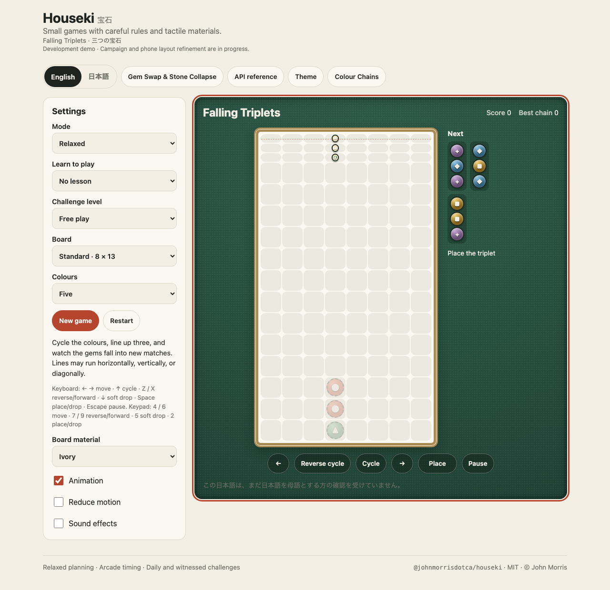
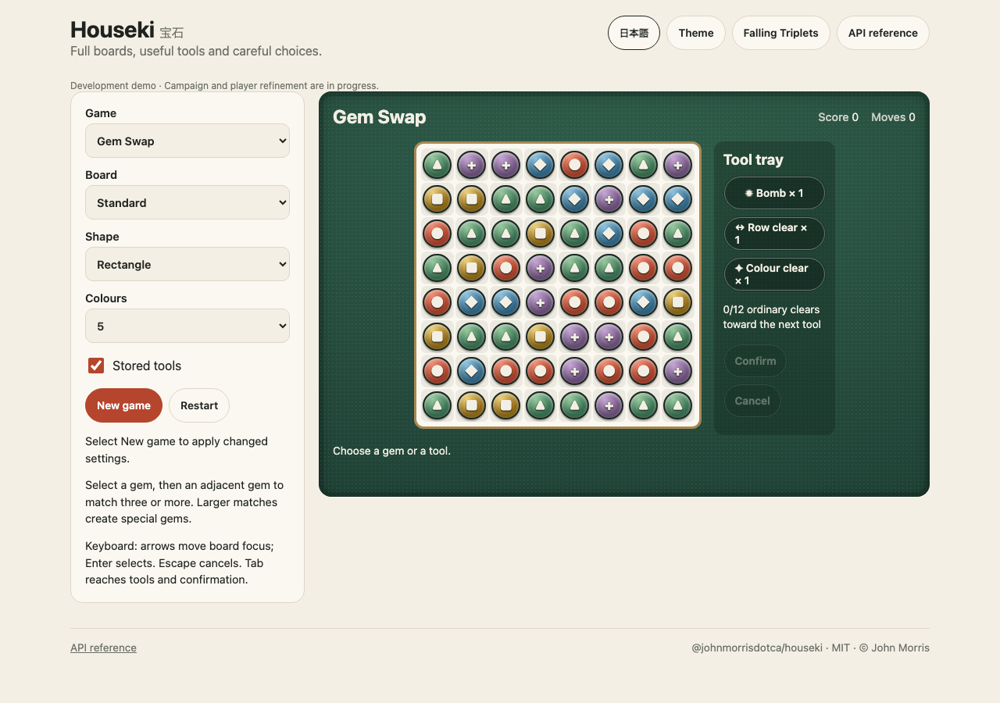

# Houseki · 宝石

[](https://github.com/johnmorrisdotca/houseki/actions/workflows/check.yml) [](LICENSE)

Original gem and stone puzzle games with immutable TypeScript rules and a shared English/Japanese player.

**Development status:** implementation and review are in progress. This repository is not yet an npm release or a claim of completed commercial polish. The website integration is maintained separately.

| Game | Distinctive mechanic |
| --- | --- |
| Falling Triplets | Cycle a falling vertical triplet; clear horizontal, vertical and diagonal lines |
| Stone Collapse | Select connected groups; plan removal order and column compression |
| Colour Chains | Rotate falling pairs; build connected groups and cascading chains |
| Gem Swap | Swap neighbours; create and combine specials to complete objectives |





[Phone layout](docs/images/tool-tray-phone.png)

[API reference](https://johnmorrisdotca.github.io/houseki/api.html) is generated locally by `pnpm site`; the hosted page becomes available after deployment. [Incremental draft PR](https://github.com/johnmorrisdotca/houseki/pull/1).

## Design and progression

The [design pack](docs/design/README.md) specifies rules, controls, materials, accessibility, generation, grading, persistence and acceptance checks. [Level generation](docs/design/LEVEL-GENERATION.md) follows a deliberate complete count and measured progression: generate and prove original boards, remove duplicates, grade player-facing decisions, then sort and number from easy to hard. Stable content IDs preserve saved progress across future ordering changes.

The shared player uses the family's ivory, brass and felt palette, permanent colour symbols and configurable boards. Each planned set of three interactive lessons is separate from the graded campaign. Physical-device feel testing and fluent Japanese copy review are recorded independently from automated checks.

## Local development

Requires Node.js 22 or newer and pnpm.

```sh
pnpm install
pnpm build
pnpm test
pnpm demo
```

The local demo instructions print its address. The first page plays Falling Triplets; `tools.html` plays Gem Swap and Stone Collapse with optional stored-tool trays. See [CONTRIBUTING.md](CONTRIBUTING.md) for contribution conventions and [the implementation plan](docs/design/IMPLEMENTATION-PLAN.md) for bounded review milestones.

## Engine example

The currently reviewed Falling Triplets entry point is independent of DOM, storage and network access:

```ts
import { createGame, applyAction, advanceTicks } from '@johnmorrisdotca/houseki/falling-triplets';

let game = createGame({ mode: 'relaxed', seed: 'first-game' });
game = applyAction(game, { kind: 'cycle-forward' }).state;
game = applyAction(game, { kind: 'place' }).state;
game = advanceTicks(game, 22).state;
```

This example describes the planned installed package; use the local build while release checks are pending. Each completed game will have its own documented entry point, supported settings and complete API reference before publishing.

## Licence

[MIT](LICENSE), copyright John Morris. Original game content and presentation are maintained in this repository. Shared family files preserve their existing copyright notices. Report vulnerabilities through [SECURITY.md](SECURITY.md).

## Stored tools

[Stored-tool rules](docs/design/STORED-TOOLS.md) distinguish inventory from special gems on the board. Gem Swap offers Bomb, Row clear and Colour clear; Stone Collapse offers Bomb and Pick. Select a tool and an occupied square, inspect the highlighted effect, then confirm or cancel. Ordinary clears earn capped inventory; using tools marks the run assisted. Daily and existing authored challenges keep their declared tool-free rules. A rare [Black Hole](docs/design/BLACK-HOLE.md) is a separate advanced milestone under development.
